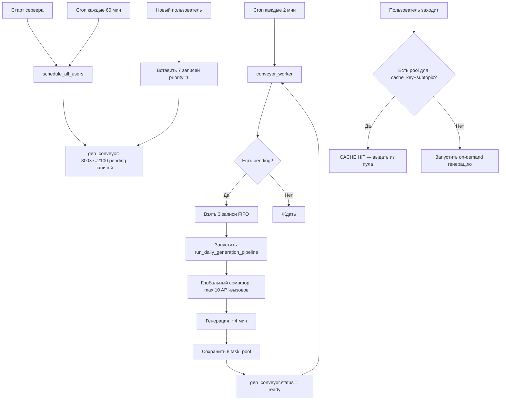

# Конвейер круглосуточной предгенерации «Задач дня»
## Архитектурный план для 300 активных пользователей

---

## 1. Как это работает сейчас

### Месячный цикл куратора
У каждого пользователя есть `curator_state.monthly_cycle` — 7 тем на 7 дней.
- День 1: тема[0], День 2: тема[1], ..., День 7: тема[6]
- `build_profile()` подставляет `curator_subtopic` = тема текущего дня
- `plan_slots()` строит 10 слотов вокруг этой подтемы

### Предгенерация (нынешняя)
- `_enqueue_tomorrow_pregen()` вызывается ПОСЛЕ успешной генерации
- Создаёт 1 запись в `pre_gen_queue` на завтра
- **`MAX_CONCURRENT_PREGEN = 2`** — только 2 одновременные генерации!
- `PREGEN_SLOT_HOURS = 24` — переполненная очередь ждёт СУТКИ
- **Нет связи с кураторским циклом** — не знает какая тема будет завтра

### Проблемы
1. 2 слота на 300 пользователей — бутылочное горлышко
2. Нет планирования на 7 дней вперёд
3. Новые пользователи не обрабатываются
4. `compute_cache_key()` не включает `curator_subtopic` — все 7 дней получат один пул

---

## 2. Новая архитектура: «Конвейер»

### 2.1. Новая таблица: `gen_conveyor`

```sql
CREATE TABLE gen_conveyor (
    id INTEGER PRIMARY KEY AUTOINCREMENT,
    cache_key TEXT NOT NULL,         -- от compute_cache_key (с curator_subtopic!)
    curator_subtopic TEXT NOT NULL,  -- slug подтемы (напр. "quadratic-equations")
    day_index INTEGER NOT NULL,      -- 1..7 (день цикла)
    grade INTEGER NOT NULL,          -- класс (5-11)
    subject TEXT NOT NULL,           -- algebra/geometry
    profile_json TEXT NOT NULL,      -- полный профиль (для пайплайна)
    status TEXT NOT NULL DEFAULT 'pending',  -- pending/generating/ready/failed
    pool_id INTEGER,                 -- FK на task_pool
    priority INTEGER DEFAULT 0,      -- 0=норм, 1=новый пользователь (срочно)
    created_at TIMESTAMP DEFAULT (datetime('now')),
    started_at TIMESTAMP,
    finished_at TIMESTAMP,
    FOREIGN KEY (pool_id) REFERENCES task_pool(id)
);

CREATE INDEX idx_conveyor_status_priority ON gen_conveyor(status, priority, day_index, id);
```

### 2.2. Изменение `compute_cache_key`

Добавить `curator_subtopic` в ключ кэша:

```python
# В compute_cache_key() добавить:
if profile.get('curator_subtopic'):
    key_data['curator_subtopic'] = profile['curator_subtopic']
```

Теперь разные дни цикла → разные пулы.

### 2.3. Глобальный rate-limiter

В [`deepseek_client.py`](daily_tasks/pipeline/deepseek_client.py) добавить:

```python
# Глобальный семафор — максимум 10 одновременных API-вызовов
_GLOBAL_SEMAPHORE = asyncio.Semaphore(10)

async def async_chat(self, model, messages, ...):
    async with _GLOBAL_SEMAPHORE:
        # ... существующий код вызова API ...
```

### 2.4. Планировщик конвейера

Новая функция `schedule_all_users()` — вызывается при старте и раз в час:

```python
def schedule_all_users():
    """
    1. Берёт ВСЕХ пользователей с monthly_cycle
    2. Вычисляет их 7 тем
    3. Строит profile для каждой темы
    4. Вычисляет cache_key (включая curator_subtopic)
    5. Вставляет записи в gen_conveyor (status='pending')
    
    Сортировка: сначала день 1 для всех → день 2 для всех → ...
    Новые пользователи: priority=1 (вне очереди)
    """
```

### 2.5. Воркер конвейера

Новая функция `conveyor_worker()` — вызывается cron'ом каждые 2 минуты:

```python
def conveyor_worker():
    """
    1. Смотрит gen_conveyor: pending записи, сортировка по (priority DESC, day_index, id)
    2. Проверяет свободные слоты (глобальный счётчик активных генераций)
    3. MAX_CONCURRENT = 3 (только 3 одновременные генерации!)
    4. Запускает генерацию для каждой pending записи
    5. При завершении → обновляет status='ready' + pool_id
    """
```

Ключевое: **не 10 и не 100 одновременных**, а **3**! Потому что каждая генерация = 10 параллельных API-вызовов внутри. 3 генерации × 10 = 30 API-вызовов — с глобальным семафором в 10 это нормально.

### 2.6. Обработка новых пользователей

При регистрации или создании monthly_cycle:

```python
def on_new_user_or_cycle(user_id):
    """
    Вставляет 7 записей в gen_conveyor с priority=1
    Записи идут вне очереди — воркер возьмёт их первыми
    """
```

---

## 3. Поток данных (Mermaid)



---

## 4. Оценка времени

| Этап | Расчёт | Время |
|------|--------|-------|
| 1 генерация | Plan(25s) + Generate(30s) + Audit(60s) + Fix(100s) | ~3.5 мин |
| 70 уникальных cache_key × 7 дней | 490 генераций | — |
| При 3 одновременных | 490 / 3 ≈ 164 очереди | — |
| **День 1 (70 генераций)** | 70 / 3 × 3.5 мин | **~82 мин** |
| **Все 7 дней (490)** | 490 / 3 × 3.5 мин | **~9.5 часов** |

После первой полной генерации — все 300 пользователей получают CACHE HIT ($0).

---

## 5. Что меняется в коде

### Файлы, которые нужно изменить:

| Файл | Изменение |
|------|-----------|
| `daily_tasks/services.py` | Новые функции: `schedule_all_users()`, `conveyor_worker()`; `compute_cache_key()` + curator_subtopic |
| `daily_tasks/pipeline/deepseek_client.py` | Глобальный `_GLOBAL_SEMAPHORE = Semaphore(10)` |
| `daily_tasks/models.py` | Новая модель `GenConveyor` |
| `app.py` | Регистрация cron-задач: `schedule_all_users` (раз в час), `conveyor_worker` (раз в 2 мин) |
| `curator/monthly_cycle.py` | Хук `on_cycle_created()` → вызов планировщика для нового пользователя |
| `daily_tasks/services.py` | `enqueue_daily_generation()` — сначала проверять `gen_conveyor`/`task_pool` |
| `daily_tasks/services.py` | Удалить `_enqueue_tomorrow_pregen()` — заменяется конвейером |

### Константы:

```python
MAX_CONVEYOR_WORKERS = 3       # одновременных генераций
GLOBAL_API_SEMAPHORE = 10      # одновременных API-вызовов
CONVEYOR_POLL_SECONDS = 120    # проверка очереди каждые 2 мин
SCHEDULE_RESYNC_MINUTES = 60   # перепланирование раз в час
```

---

## 6. План реализации (TODO)

1. [ ] Добавить `curator_subtopic` в `compute_cache_key()`
2. [ ] Создать модель `GenConveyor` и миграцию
3. [ ] Написать `schedule_all_users()` — планирование 7 дней для всех
4. [ ] Написать `conveyor_worker()` — обработка очереди по 3 генерации
5. [ ] Добавить глобальный `_GLOBAL_SEMAPHORE` в `deepseek_client.py`
6. [ ] Интегрировать в `enqueue_daily_generation()` — сначала проверять конвейер
7. [ ] Добавить хук для новых пользователей в `monthly_cycle.py`
8. [ ] Зарегистрировать cron-задачи в `app.py`
9. [ ] Удалить `_enqueue_tomorrow_pregen()` (старая система)
10. [ ] Тест: запустить `schedule_all_users()` и `conveyor_worker()` на 1 пользователе
