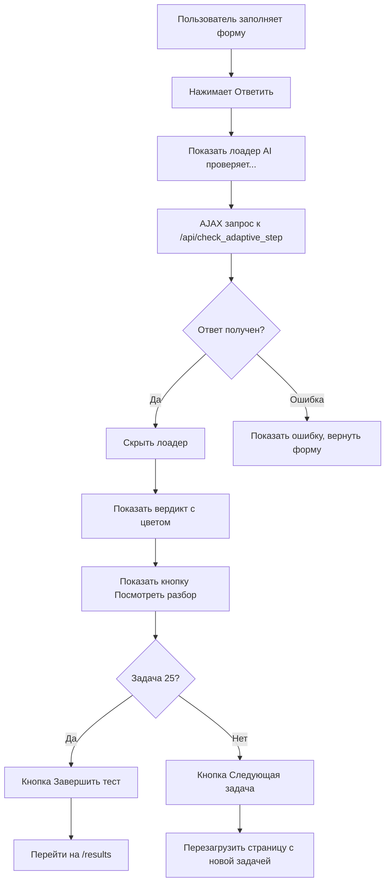

# AI-Powered Adaptive Testing Architecture

## 🎯 Цель
Реализовать умную проверку ответов в адаптивном тестировании через DeepSeek API с детальной оценкой решений и адаптацией сложности.

## 📊 Текущее состояние

### ✅ Что уже есть:
1. **Базовый адаптивный тест** - [`app.py:2762`](app.py:2762) - `adaptive_test_simple_submit()`
2. **DeepSeek Client** - [`ai/deepseek_client.py`](ai/deepseek_client.py) - готовый клиент для API
3. **Модель AdaptiveTask** - задачи с уровнями сложности 1-7
4. **Фронтенд** - [`templates/adaptive_test_simple.html`](templates/adaptive_test_simple.html) - форма с ответом, решением и фото
5. **Изоляция пользователей** - история в БД по `user_id`

### ❌ Что нужно улучшить:
1. **Примитивная проверка** - сейчас `is_correct = len(user_answer) > 0` (строка 2783)
2. **Нет AI-оценки** - не используется DeepSeek для проверки
3. **Нет градации оценок** - только "верно/неверно", нет +2/+1/-1
4. **Нет feedback от AI** - пользователь не видит разбор ошибок
5. **Синхронная обработка** - форма submit блокирует UI

---

## 🏗️ Архитектура решения

### 1. Backend: Новый API Endpoint

**Маршрут:** `POST /api/check_adaptive_step`

**Входные данные:**
```json
{
  "task_id": 12345,
  "user_answer": "42",
  "user_solution": "Решал через уравнение x + 5 = 47...",
  "solution_photo_base64": "data:image/png;base64,..." // опционально
}
```

**Логика обработки:**

```python
@app.route("/api/check_adaptive_step", methods=["POST"])
@login_required
def check_adaptive_step():
    # 1. Получить данные
    data = request.get_json()
    task_id = data.get('task_id')
    user_answer = data.get('user_answer', '').strip()
    user_solution = data.get('user_solution', '').strip()
    photo_base64 = data.get('solution_photo_base64')
    
    # 2. Найти задачу в БД
    task = AdaptiveTask.query.get(task_id)
    if not task:
        return jsonify({'error': 'Задача не найдена'}), 404
    
    # 3. Сформировать промпт для DeepSeek
    prompt = f"""Ты — строгое жюри математической олимпиады. Оцени решение ученика.

ЗАДАЧА:
{task.task_text}

ЭТАЛОННЫЙ ОТВЕТ: {task.correct_answer}
ЭТАЛОННОЕ РЕШЕНИЕ: {task.solution or 'Не предоставлено'}

ОТВЕТ УЧЕНИКА: {user_answer}
ХОД РЕШЕНИЯ УЧЕНИКА: {user_solution or 'Не предоставлен'}

КРИТЕРИИ ОЦЕНКИ:
- score = 2: Ответ полностью верен, решение логичное и правильное
- score = 1: Идея верна, но есть арифметическая ошибка ИЛИ ответ близок к правильному ИЛИ частичное продвижение
- score = -1: Ответ неверен, решение ошибочно или отсутствует

Верни СТРОГО JSON (без markdown):
{{
  "score": 2 или 1 или -1,
  "feedback": "Краткий комментарий об ошибках или похвала (2-3 предложения)"
}}"""

    # 4. Вызвать DeepSeek API
    client = DeepSeekClient()
    try:
        response_text = client.generate(
            prompt=prompt,
            temperature=0.1,  # Низкая температура для стабильности
            max_tokens=500
        )
        
        # 5. Распарсить JSON
        result = json.loads(response_text)
        score = result.get('score', -1)
        feedback = result.get('feedback', '')
        
    except Exception as e:
        # Fallback: простая проверка
        score = 1 if user_answer else -1
        feedback = f"AI временно недоступен. Ответ принят."
    
    # 6. Обновить уровень сложности в сессии
    current_level = session.get('adaptive_current_difficulty', 3)
    new_level = max(1, min(7, current_level + score))
    session['adaptive_current_difficulty'] = new_level
    
    # 7. Сохранить результат
    if 'adaptive_answers' not in session:
        session['adaptive_answers'] = []
    
    session['adaptive_answers'].append({
        'task_id': task_id,
        'user_answer': user_answer,
        'user_solution': user_solution,
        'correct_answer': task.correct_answer,
        'is_correct': score > 0,
        'score': score,
        'feedback': feedback,
        'difficulty': task.difficulty_level,
        'new_level': new_level
    })
    
    # 8. Увеличить счетчик
    current_index = session.get('adaptive_current_index', 0) + 1
    session['adaptive_current_index'] = current_index
    session.modified = True
    
    # 9. Вернуть результат
    return jsonify({
        'success': True,
        'score': score,
        'feedback': feedback,
        'new_level': new_level,
        'old_level': current_level,
        'correct_answer': task.correct_answer,
        'is_finished': current_index >= 25
    })
```

**Преимущества:**
- ✅ Асинхронная проверка через AJAX (не блокирует UI)
- ✅ Детальная оценка (+2, +1, -1)
- ✅ Feedback от AI для каждого ответа
- ✅ Fallback при ошибке API
- ✅ Изоляция по пользователям (session)

---

### 2. Frontend: Обновление UI

**Файл:** [`templates/adaptive_test_simple.html`](templates/adaptive_test_simple.html)

**Изменения:**

#### A. Заменить form submit на AJAX

```html
<!-- Вместо <form method="POST" action="/adaptive_test_simple/submit"> -->
<form id="adaptiveForm" onsubmit="submitAnswer(event)">
    <!-- ... поля формы ... -->
    
    <button type="submit" id="submitBtn">
        Ответить →
    </button>
</form>

<!-- Лоадер (скрыт по умолчанию) -->
<div id="checkingLoader" style="display: none; text-align: center; padding: 40px;">
    <div class="spinner"></div>
    <p style="color: var(--text-soft); font-size: 1.2em;">
        🤖 AI проверяет ваше решение...
    </p>
</div>

<!-- Результат проверки (скрыт по умолчанию) -->
<div id="resultBlock" style="display: none;">
    <div id="verdict" style="padding: 20px; border-radius: 12px; margin: 20px 0;">
        <!-- Динамически заполняется JS -->
    </div>
    
    <details style="margin: 20px 0;">
        <summary style="cursor: pointer; color: var(--accent-2); font-weight: 600;">
            💬 Посмотреть разбор от AI
        </summary>
        <div id="aiFeedback" style="padding: 15px; background: rgba(0,0,0,0.2); border-radius: 8px; margin-top: 10px;">
            <!-- Динамически заполняется JS -->
        </div>
    </details>
    
    <button onclick="nextTask()" id="nextBtn">
        Следующая задача →
    </button>
</div>
```

#### B. JavaScript для AJAX-проверки

```javascript
async function submitAnswer(event) {
    event.preventDefault();
    
    const form = document.getElementById('adaptiveForm');
    const submitBtn = document.getElementById('submitBtn');
    const loader = document.getElementById('checkingLoader');
    const resultBlock = document.getElementById('resultBlock');
    
    // Собираем данные
    const formData = new FormData(form);
    const data = {
        task_id: formData.get('task_id'),
        user_answer: formData.get('answer'),
        user_solution: formData.get('solution') || ''
    };
    
    // Обработка фото (если есть)
    const photoFile = formData.get('solution_photo');
    if (photoFile && photoFile.size > 0) {
        const base64 = await fileToBase64(photoFile);
        data.solution_photo_base64 = base64;
    }
    
    // Показываем лоадер
    form.style.display = 'none';
    loader.style.display = 'block';
    submitBtn.disabled = true;
    
    try {
        const response = await fetch('/api/check_adaptive_step', {
            method: 'POST',
            headers: {'Content-Type': 'application/json'},
            body: JSON.stringify(data)
        });
        
        const result = await response.json();
        
        // Скрываем лоадер
        loader.style.display = 'none';
        resultBlock.style.display = 'block';
        
        // Показываем вердикт
        showVerdict(result);
        
    } catch (error) {
        alert('Ошибка проверки: ' + error.message);
        form.style.display = 'block';
        loader.style.display = 'none';
        submitBtn.disabled = false;
    }
}

function showVerdict(result) {
    const verdictDiv = document.getElementById('verdict');
    const feedbackDiv = document.getElementById('aiFeedback');
    const nextBtn = document.getElementById('nextBtn');
    
    // Определяем цвет и текст по score
    let color, emoji, text;
    if (result.score === 2) {
        color = '#22c55e';
        emoji = '🎉';
        text = 'Идеально! +2 уровня';
    } else if (result.score === 1) {
        color = '#f59e0b';
        emoji = '👍';
        text = 'Частично верно! +1 уровень';
    } else {
        color = '#ef4444';
        emoji = '❌';
        text = 'Неверно. -1 уровень';
    }
    
    verdictDiv.innerHTML = `
        <div style="background: ${color}20; border: 2px solid ${color}; border-radius: 12px; padding: 20px; text-align: center;">
            <div style="font-size: 3em;">${emoji}</div>
            <div style="font-size: 1.5em; font-weight: 600; color: ${color}; margin: 10px 0;">
                ${text}
            </div>
            <div style="color: var(--text-soft); font-size: 0.9em;">
                Уровень: ${result.old_level} → ${result.new_level}
            </div>
            <div style="margin-top: 15px; padding: 10px; background: rgba(0,0,0,0.2); border-radius: 8px;">
                <strong>Правильный ответ:</strong> ${result.correct_answer}
            </div>
        </div>
    `;
    
    feedbackDiv.textContent = result.feedback;
    
    // Меняем текст кнопки на последней задаче
    if (result.is_finished) {
        nextBtn.textContent = '✅ Завершить тест';
        nextBtn.onclick = () => window.location.href = '/adaptive_test_simple/results';
    }
}

function nextTask() {
    window.location.href = '/adaptive_test_simple';
}

function fileToBase64(file) {
    return new Promise((resolve, reject) => {
        const reader = new FileReader();
        reader.onload = () => resolve(reader.result);
        reader.onerror = reject;
        reader.readAsDataURL(file);
    });
}
```

---

### 3. Модель данных

**Проверить наличие полей в AdaptiveTask:**
- `task_text` ✅
- `difficulty_level` ✅
- `correct_answer` ❓ (нужно добавить, если нет)
- `solution` ❓ (нужно добавить, если нет)

**Если полей нет, добавить миграцию:**
```python
# В models.py или через Flask-Migrate
class AdaptiveTask(db.Model):
    # ... существующие поля ...
    correct_answer = db.Column(db.String(500))  # Правильный ответ
    solution = db.Column(db.Text)  # Эталонное решение
```

---

### 4. Промпт для DeepSeek

**Ключевые требования к промпту:**

1. **Роль:** "Ты — строгое жюри математической олимпиады"
2. **Контекст:** Условие задачи + эталонное решение + эталонный ответ
3. **Задача:** Оценить ответ и решение ученика
4. **Формат вывода:** Строго JSON с полями `score` и `feedback`
5. **Критерии:**
   - `score = 2`: Идеально (ответ верен, решение логичное)
   - `score = 1`: Частично верно (идея верна, но ошибка в вычислениях)
   - `score = -1`: Неверно (ответ неверен или решение ошибочно)

**Пример промпта:**
```
Ты — строгое жюри математической олимпиады. Оцени решение ученика.

ЗАДАЧА:
Найдите корень уравнения: 2x + 5 = 17

ЭТАЛОННЫЙ ОТВЕТ: 6
ЭТАЛОННОЕ РЕШЕНИЕ: 2x = 17 - 5 = 12, x = 12/2 = 6

ОТВЕТ УЧЕНИКА: 6
ХОД РЕШЕНИЯ УЧЕНИКА: Перенес 5 вправо, получил 2x = 12, разделил на 2

КРИТЕРИИ:
- score = 2: Ответ верен, решение правильное
- score = 1: Идея верна, но арифметическая ошибка
- score = -1: Ответ неверен или решение ошибочно

Верни СТРОГО JSON (без markdown):
{"score": 2, "feedback": "Отлично! Решение верное."}
```

---

### 5. Обработка ответа AI

**Парсинг JSON:**
```python
try:
    # Убираем markdown если есть
    response_text = response_text.strip()
    if response_text.startswith('```'):
        response_text = response_text.split('```')[1]
        if response_text.startswith('json'):
            response_text = response_text[4:]
    
    result = json.loads(response_text)
    score = int(result.get('score', -1))
    feedback = result.get('feedback', '')
    
    # Валидация score
    if score not in [-1, 1, 2]:
        score = -1
        
except (json.JSONDecodeError, ValueError) as e:
    # Fallback: простая проверка
    logger.error(f"Failed to parse AI response: {e}")
    score = 1 if user_answer else -1
    feedback = "AI временно недоступен. Ответ принят для продолжения теста."
```

---

### 6. Адаптация уровня сложности

**Логика изменения уровня:**

```python
current_level = session.get('adaptive_current_difficulty', 3)

# Применяем score
new_level = current_level + score

# Ограничиваем диапазон [1, 7]
new_level = max(1, min(7, new_level))

session['adaptive_current_difficulty'] = new_level
```

**Примеры:**
- Уровень 3, score = 2 → новый уровень 5
- Уровень 6, score = 2 → новый уровень 7 (макс)
- Уровень 2, score = -1 → новый уровень 1 (мин)
- Уровень 4, score = 1 → новый уровень 5

---

### 7. Frontend UX Flow



---

### 8. Обработка фото решения

**Если пользователь загрузил фото:**

1. **Frontend:** Конвертировать файл в base64
2. **Backend:** Передать base64 в DeepSeek (если API поддерживает vision)
3. **Промпт:** Добавить "[Ученик прикрепил фото решения - см. изображение]"

**Примечание:** DeepSeek может не поддерживать vision. В этом случае:
- Сохранить фото в БД для ручной проверки преподавателем
- Или использовать OCR (Tesseract) для извлечения текста

---

### 9. Безопасность и производительность

**Защита от злоупотреблений:**
- ✅ `@login_required` - только авторизованные пользователи
- ✅ Rate limiting (опционально): макс 30 запросов в минуту на пользователя
- ✅ Timeout 90 секунд для AI-запроса

**Оптимизация:**
- ✅ Gunicorn с 4 workers × 4 threads = 16 параллельных запросов
- ✅ Кеширование результатов (опционально): если тот же ответ на ту же задачу
- ✅ Fallback при ошибке API

---

### 10. Миграция данных

**Если в AdaptiveTask нет полей `correct_answer` и `solution`:**

```python
# Создать миграцию
flask db migrate -m "Add correct_answer and solution to AdaptiveTask"
flask db upgrade

# Или добавить вручную в models.py:
class AdaptiveTask(db.Model):
    # ... existing fields ...
    correct_answer = db.Column(db.String(500), nullable=True)
    solution = db.Column(db.Text, nullable=True)
```

**Заполнить данные:**
- Для существующих задач добавить ответы и решения
- Или использовать AI для генерации решений

---

## 📋 План реализации

### Этап 1: Backend API
1. Проверить наличие полей `correct_answer` и `solution` в `AdaptiveTask`
2. Добавить поля, если их нет (миграция БД)
3. Создать endpoint `/api/check_adaptive_step` с AI-проверкой
4. Добавить fallback при ошибке API
5. Протестировать endpoint через Postman/curl

### Этап 2: Frontend
1. Заменить form submit на AJAX в `adaptive_test_simple.html`
2. Добавить лоадер с анимацией
3. Добавить блок результата с вердиктом
4. Добавить кнопку "Посмотреть разбор от AI"
5. Реализовать логику "Следующая задача" vs "Завершить тест"

### Этап 3: Интеграция
1. Обновить `/adaptive_test_simple` для загрузки следующей задачи
2. Обновить `/adaptive_test_simple/results` для отображения детальной статистики
3. Добавить отображение feedback от AI в результатах

### Этап 4: Тестирование
1. Протестировать с разными ответами (верными, частично верными, неверными)
2. Проверить адаптацию уровня сложности
3. Проверить работу с фото
4. Проверить fallback при ошибке API

### Этап 5: Деплой
1. Запушить изменения на GitHub
2. Проверить работу на Render
3. Мониторить логи на ошибки

---

## 🎨 UI/UX Детали

### Цвета вердиктов:
- **score = 2:** Зеленый (#22c55e) - "🎉 Идеально!"
- **score = 1:** Оранжевый (#f59e0b) - "👍 Частично верно!"
- **score = -1:** Красный (#ef4444) - "❌ Неверно"

### Анимации:
- Лоадер: вращающийся спиннер
- Вердикт: fade-in анимация
- Кнопки: hover эффекты

### Адаптивность:
- На мобильных: кнопки на всю ширину
- Лоадер: центрирован
- Feedback: читаемый шрифт

---

## ⚠️ Потенциальные проблемы

### 1. DeepSeek возвращает не-JSON
**Решение:** Regex для извлечения JSON из markdown или fallback

### 2. AI дает некорректную оценку
**Решение:** Логирование всех оценок для ручного аудита

### 3. Медленный ответ API (>30 сек)
**Решение:** Timeout 90 сек + лоадер с текстом "Это может занять до минуты..."

### 4. Пользователь закрывает страницу во время проверки
**Решение:** Сохранять промежуточный результат в session

### 5. Нет полей `correct_answer` в базе
**Решение:** Добавить миграцию или использовать временные заглушки

---

## 📊 Метрики успеха

После реализации отслеживать:
- **Точность AI-оценки:** % совпадений с ручной проверкой
- **Время ответа API:** среднее время проверки одного ответа
- **Процент fallback:** как часто используется простая проверка
- **Удовлетворенность пользователей:** feedback через опросы

---

## 🚀 Следующие шаги

1. Проверить модель `AdaptiveTask` на наличие нужных полей
2. Создать новый API endpoint
3. Обновить фронтенд
4. Протестировать
5. Задеплоить

Готов к реализации!
