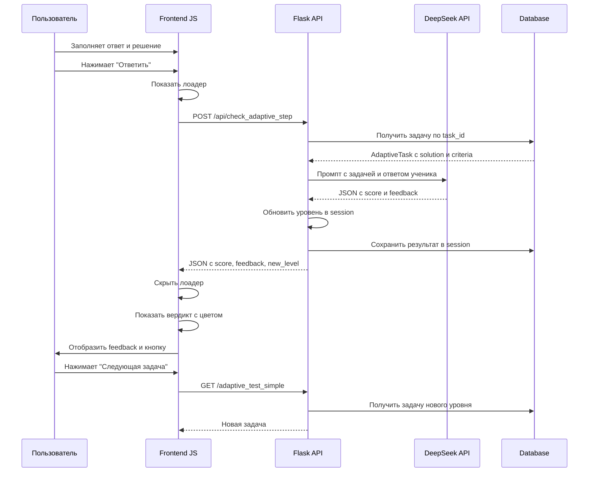

# План реализации AI-проверки для адаптивного тестирования

## 📋 Краткое резюме

Реализуем умную проверку ответов через DeepSeek API с градацией оценок (+2, +1, -1) и детальным feedback для каждого ответа.

---

## 🔍 Анализ текущего состояния

### ✅ Что уже работает:

1. **Модель AdaptiveTask** ([`models.py:448`](models.py:448))
   - `task_text` - условие задачи
   - `solution` - полное авторское решение ✅
   - `criteria_1_point` - критерий на 1 балл ✅
   - `criteria_2_points` - критерий на 2 балла ✅
   - `difficulty_level` - уровень 1-7 ✅

2. **DeepSeek Client** ([`ai/deepseek_client.py`](ai/deepseek_client.py))
   - Метод `generate()` для вызова API ✅
   - Retry logic с exponential backoff ✅
   - Timeout 90 секунд ✅

3. **Текущий обработчик** ([`app.py:2762`](app.py:2762))
   - Сохранение ответов в session ✅
   - Адаптация уровня сложности ✅
   - Счетчик задач (25 максимум) ✅

4. **Фронтенд** ([`templates/adaptive_test_simple.html`](templates/adaptive_test_simple.html))
   - Форма с полями: answer, solution, solution_photo ✅
   - Отображение уровня сложности ✅
   - Счетчик задач ✅

### ❌ Что нужно добавить:

1. **Поле `correct_answer`** в модели AdaptiveTask
2. **API endpoint** `/api/check_adaptive_step` с AI-проверкой
3. **AJAX-обработка** вместо form submit
4. **UI для результата** - лоадер, вердикт, feedback, кнопка "Следующая задача"

---

## 🏗️ Архитектура решения

### Диаграмма потока данных



---

## 📝 Детальный план реализации

### Шаг 1: Добавить поле `correct_answer` в модель

**Файл:** [`models.py`](models.py:448)

```python
class AdaptiveTask(db.Model):
    # ... existing fields ...
    solution = db.Column(db.Text, nullable=False)
    correct_answer = db.Column(db.String(500), nullable=True)  # НОВОЕ ПОЛЕ
    criteria_1_point = db.Column(db.Text, nullable=False)
    # ...
```

**Миграция:**
```bash
# Если используется Flask-Migrate
flask db migrate -m "Add correct_answer to AdaptiveTask"
flask db upgrade

# Или SQL напрямую
ALTER TABLE adaptive_tasks ADD COLUMN correct_answer VARCHAR(500);
```

**Заполнение данных:**
- Для существующих задач: извлечь ответ из `solution` или оставить NULL
- Для новых задач: генерировать вместе с задачей

---

### Шаг 2: Создать API endpoint `/api/check_adaptive_step`

**Файл:** [`app.py`](app.py) (добавить после строки 2815)

**Код:**
```python
@app.route("/api/check_adaptive_step", methods=["POST"])
@login_required
def check_adaptive_step():
    """
    Умная проверка ответа через DeepSeek API.
    Возвращает score (-1, +1, +2) и feedback.
    """
    if not DEEPSEEK_AVAILABLE:
        return jsonify({'error': 'AI недоступен'}), 503
    
    data = request.get_json()
    task_id = data.get('task_id')
    user_answer = data.get('user_answer', '').strip()
    user_solution = data.get('user_solution', '').strip()
    
    # Найти задачу
    task = AdaptiveTask.query.get(task_id)
    if not task:
        return jsonify({'error': 'Задача не найдена'}), 404
    
    # Сформировать промпт
    prompt = f"""Ты — строгое жюри математической олимпиады. Оцени решение ученика.

ЗАДАЧА:
{task.task_text}

ЭТАЛОННЫЙ ОТВЕТ: {task.correct_answer or 'Не указан'}
ЭТАЛОННОЕ РЕШЕНИЕ: {task.solution}

КРИТЕРИИ ОЦЕНКИ:
- 2 балла: {task.criteria_2_points}
- 1 балл: {task.criteria_1_point}
- 0 баллов: Ответ неверен или решение ошибочно

ОТВЕТ УЧЕНИКА: {user_answer}
ХОД РЕШЕНИЯ УЧЕНИКА: {user_solution or 'Не предоставлен'}

Оцени решение и верни СТРОГО JSON (без markdown, без комментариев):
{{"score": 2 или 1 или -1, "feedback": "Краткий комментарий 2-3 предложения"}}

Где score:
- 2 = полностью верно
- 1 = частично верно (идея верна, но ошибка)
- -1 = неверно
"""

    try:
        # Вызов DeepSeek
        client = DeepSeekClient()
        response_text = client.generate(
            prompt=prompt,
            temperature=0.1,
            max_tokens=500
        )
        
        # Парсинг JSON (убираем markdown если есть)
        response_text = response_text.strip()
        if '```' in response_text:
            # Извлекаем JSON из markdown блока
            parts = response_text.split('```')
            for part in parts:
                if part.strip().startswith('json'):
                    response_text = part.replace('json', '', 1).strip()
                elif part.strip().startswith('{'):
                    response_text = part.strip()
        
        result = json.loads(response_text)
        score = int(result.get('score', -1))
        feedback = result.get('feedback', '')
        
        # Валидация score
        if score not in [-1, 1, 2]:
            logger.warning(f"Invalid score from AI: {score}, defaulting to -1")
            score = -1
            
    except Exception as e:
        logger.error(f"AI check failed: {e}")
        # Fallback: простая проверка
        score = 1 if user_answer else -1
        feedback = "AI временно недоступен. Ответ принят для продолжения теста."
    
    # Обновить уровень
    current_level = session.get('adaptive_current_difficulty', 3)
    new_level = max(1, min(7, current_level + score))
    session['adaptive_current_difficulty'] = new_level
    
    # Сохранить результат
    if 'adaptive_answers' not in session:
        session['adaptive_answers'] = []
    
    session['adaptive_answers'].append({
        'task_id': task_id,
        'user_answer': user_answer,
        'user_solution': user_solution,
        'correct_answer': task.correct_answer or 'Не указан',
        'is_correct': score > 0,
        'score': score,
        'feedback': feedback,
        'difficulty': task.difficulty_level,
        'new_level': new_level
    })
    
    # Увеличить счетчик
    current_index = session.get('adaptive_current_index', 0) + 1
    session['adaptive_current_index'] = current_index
    session.modified = True
    
    return jsonify({
        'success': True,
        'score': score,
        'feedback': feedback,
        'new_level': new_level,
        'old_level': current_level,
        'correct_answer': task.correct_answer or 'Не указан',
        'is_finished': current_index >= 25,
        'current_index': current_index
    })
```

---

### Шаг 3: Обновить фронтенд

**Файл:** [`templates/adaptive_test_simple.html`](templates/adaptive_test_simple.html)

**Изменения:**

#### 1. Заменить form action на JavaScript

```html
<!-- БЫЛО: -->
<form method="POST" action="/adaptive_test_simple/submit">

<!-- СТАЛО: -->
<form id="adaptiveForm" onsubmit="submitAnswer(event); return false;">
```

#### 2. Добавить блоки для лоадера и результата

```html
<!-- После формы, перед закрывающим </div> -->

<!-- Лоадер -->
<div id="checkingLoader" style="display: none; text-align: center; padding: 40px; margin-top: 30px;">
    <div style="border: 4px solid rgba(255,255,255,0.1); border-top: 4px solid var(--accent-2); border-radius: 50%; width: 60px; height: 60px; animation: spin 1s linear infinite; margin: 0 auto 20px;"></div>
    <p style="color: var(--text-soft); font-size: 1.2em;">
        🤖 AI проверяет ваше решение...
    </p>
    <p style="color: var(--text-muted); font-size: 0.9em; margin-top: 10px;">
        Это может занять до минуты
    </p>
</div>

<!-- Результат -->
<div id="resultBlock" style="display: none; margin-top: 30px;">
    <div id="verdictCard">
        <!-- Динамически заполняется JS -->
    </div>
    
    <details style="margin: 20px 0; background: rgba(30, 41, 59, 0.6); padding: 15px; border-radius: 12px; border: 1px solid var(--border-soft);">
        <summary style="cursor: pointer; color: var(--accent-2); font-weight: 600; font-size: 1.1em; user-select: none;">
            💬 Посмотреть разбор от AI
        </summary>
        <div id="aiFeedback" style="padding: 15px 0; color: var(--text-soft); line-height: 1.7;">
            <!-- Динамически заполняется JS -->
        </div>
    </details>
    
    <div style="text-align: center;">
        <button id="nextBtn" onclick="nextTask()" 
                style="padding: 15px 50px; background: linear-gradient(135deg, var(--accent-1), var(--accent-2)); color: white; border: none; border-radius: var(--radius-sm); font-weight: 600; font-size: 16px; cursor: pointer; box-shadow: 0 4px 12px rgba(59, 130, 246, 0.3);">
            Следующая задача →
        </button>
    </div>
</div>

<style>
@keyframes spin {
    0% { transform: rotate(0deg); }
    100% { transform: rotate(360deg); }
}
</style>
```

#### 3. Добавить JavaScript

```html
<script>
async function submitAnswer(event) {
    event.preventDefault();
    
    const form = document.getElementById('adaptiveForm');
    const submitBtn = form.querySelector('button[type="submit"]');
    const loader = document.getElementById('checkingLoader');
    const resultBlock = document.getElementById('resultBlock');
    
    // Собираем данные
    const formData = new FormData(form);
    const data = {
        task_id: formData.get('task_id'),
        user_answer: formData.get('answer') || '',
        user_solution: formData.get('solution') || ''
    };
    
    // Показываем лоадер
    form.style.display = 'none';
    loader.style.display = 'block';
    submitBtn.disabled = true;
    
    try {
        const response = await fetch('/api/check_adaptive_step', {
            method: 'POST',
            headers: {'Content-Type': 'application/json'},
            body: JSON.stringify(data)
        });
        
        if (!response.ok) {
            throw new Error('Ошибка сервера');
        }
        
        const result = await response.json();
        
        // Скрываем лоадер
        loader.style.display = 'none';
        resultBlock.style.display = 'block';
        
        // Показываем вердикт
        showVerdict(result);
        
    } catch (error) {
        console.error('Error:', error);
        alert('Ошибка проверки: ' + error.message);
        form.style.display = 'block';
        loader.style.display = 'none';
        submitBtn.disabled = false;
    }
}

function showVerdict(result) {
    const verdictCard = document.getElementById('verdictCard');
    const feedbackDiv = document.getElementById('aiFeedback');
    const nextBtn = document.getElementById('nextBtn');
    
    // Определяем цвет и текст по score
    let color, emoji, text, levelChange;
    if (result.score === 2) {
        color = '#22c55e';
        emoji = '🎉';
        text = 'Идеально!';
        levelChange = '+2 уровня';
    } else if (result.score === 1) {
        color = '#f59e0b';
        emoji = '👍';
        text = 'Частично верно!';
        levelChange = '+1 уровень';
    } else {
        color = '#ef4444';
        emoji = '❌';
        text = 'Неверно';
        levelChange = '-1 уровень';
    }
    
    verdictCard.innerHTML = `
        <div style="background: linear-gradient(135deg, ${color}20, ${color}10); border: 2px solid ${color}; border-radius: 16px; padding: 30px; text-align: center;">
            <div style="font-size: 4em; margin-bottom: 15px;">${emoji}</div>
            <div style="font-size: 1.8em; font-weight: 700; color: ${color}; margin-bottom: 10px;">
                ${text}
            </div>
            <div style="font-size: 1.2em; color: var(--text-soft); margin-bottom: 20px;">
                ${levelChange}
            </div>
            <div style="display: flex; justify-content: center; gap: 30px; margin-top: 20px;">
                <div style="text-align: center;">
                    <div style="color: var(--text-muted); font-size: 0.9em; margin-bottom: 5px;">Старый уровень</div>
                    <div style="font-size: 2em; font-weight: 700; color: var(--accent-1);">${result.old_level}</div>
                </div>
                <div style="font-size: 2em; color: var(--text-muted);">→</div>
                <div style="text-align: center;">
                    <div style="color: var(--text-muted); font-size: 0.9em; margin-bottom: 5px;">Новый уровень</div>
                    <div style="font-size: 2em; font-weight: 700; color: var(--accent-2);">${result.new_level}</div>
                </div>
            </div>
            <div style="margin-top: 20px; padding: 15px; background: rgba(0,0,0,0.3); border-radius: 10px;">
                <div style="color: var(--text-muted); font-size: 0.9em; margin-bottom: 5px;">Правильный ответ:</div>
                <div style="font-size: 1.3em; font-weight: 600; color: #22c55e;">${result.correct_answer}</div>
            </div>
        </div>
    `;
    
    feedbackDiv.innerHTML = `<p style="margin: 0;">${result.feedback}</p>`;
    
    // Меняем текст кнопки на последней задаче
    if (result.is_finished) {
        nextBtn.innerHTML = '✅ Завершить тест';
        nextBtn.onclick = () => window.location.href = '/adaptive_test_simple/results';
    } else {
        nextBtn.innerHTML = `Следующая задача (${result.current_index}/25) →`;
    }
}

function nextTask() {
    window.location.href = '/adaptive_test_simple';
}
</script>
```

---

### Шаг 4: Обновить страницу результатов

**Файл:** [`templates/adaptive_test_simple_results.html`](templates/adaptive_test_simple_results.html)

**Добавить отображение:**
- Детальная статистика по каждой задаче
- Feedback от AI для каждого ответа
- График изменения уровня сложности

---

## 🔒 Безопасность и производительность

### 1. Защита от злоупотреблений

```python
# Rate limiting (опционально)
from flask_limiter import Limiter

limiter = Limiter(app, key_func=lambda: current_user.id)

@app.route("/api/check_adaptive_step", methods=["POST"])
@login_required
@limiter.limit("30 per minute")  # Макс 30 проверок в минуту
def check_adaptive_step():
    # ...
```

### 2. Timeout и retry

- DeepSeek timeout: 90 секунд
- Retry logic: 2 попытки с exponential backoff
- Fallback: простая проверка при ошибке

### 3. Параллельная обработка

- Gunicorn: 4 workers × 4 threads = 16 параллельных запросов
- Каждый запрос к AI обрабатывается в отдельном потоке
- Session изолирована по пользователям

---

## 📊 Метрики и мониторинг

### Логирование

```python
logger.info(f"AI check: user={current_user.id}, task={task_id}, score={score}")
logger.error(f"AI parse error: {response_text}")
```

### Метрики для отслеживания

1. **Время ответа AI:** среднее, медиана, 95-й перцентиль
2. **Процент fallback:** как часто используется простая проверка
3. **Распределение оценок:** сколько +2, +1, -1
4. **Точность AI:** сравнение с ручной проверкой (выборочно)

---

## ⚠️ Потенциальные проблемы и решения

### Проблема 1: AI возвращает не-JSON

**Решение:**
```python
# Regex для извлечения JSON
import re
json_match = re.search(r'\{[^}]+\}', response_text)
if json_match:
    response_text = json_match.group(0)
```

### Проблема 2: AI дает некорректную оценку

**Решение:**
- Логировать все оценки
- Добавить кнопку "Пожаловаться на оценку"
- Ручной аудит выборки оценок

### Проблема 3: Медленный ответ (>60 сек)

**Решение:**
- Показать прогресс-бар с таймером
- Текст "Сложная задача, AI думает..."
- Timeout 90 сек, затем fallback

### Проблема 4: Нет `correct_answer` в базе

**Решение:**
- Временно: извлекать из `solution` через regex
- Долгосрочно: добавить поле и заполнить данные

---

## 🎯 Критерии успеха

После реализации проверить:

✅ **Функциональность:**
- [ ] AI корректно оценивает верные ответы (score = 2)
- [ ] AI корректно оценивает частично верные (score = 1)
- [ ] AI корректно оценивает неверные (score = -1)
- [ ] Уровень адаптируется правильно
- [ ] Feedback понятен и полезен

✅ **UX:**
- [ ] Лоадер показывается сразу
- [ ] Вердикт отображается с правильным цветом
- [ ] Кнопка "Следующая задача" работает
- [ ] На 25-й задаче показывается "Завершить тест"

✅ **Производительность:**
- [ ] Ответ AI приходит за <30 сек в 90% случаев
- [ ] Fallback срабатывает при ошибке
- [ ] Параллельные запросы не блокируют друг друга

✅ **Безопасность:**
- [ ] Только авторизованные пользователи
- [ ] Session изолирована
- [ ] Нет утечки данных между пользователями

---

## 📅 Оценка сложности

**Общая сложность:** Средняя-Высокая

**Компоненты:**
- Backend API endpoint: Средняя (2-3 часа)
- Frontend AJAX: Средняя (2-3 часа)
- Миграция БД: Низкая (30 минут)
- Тестирование: Средняя (1-2 часа)
- Деплой и мониторинг: Низкая (30 минут)

---

## 🚀 Готов к реализации!

План детально проработан. Можно переходить в режим Code для реализации.

**Следующий шаг:** Переключиться в Code mode и начать с добавления поля `correct_answer` в модель.
